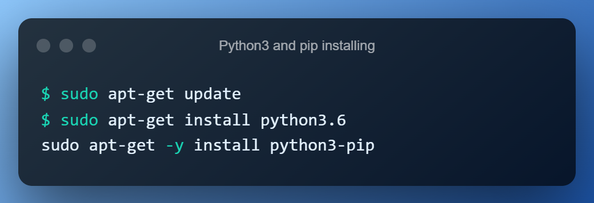

---------


-----------

💬 Welcome to my first game project
===

✅ 🙾Here you can try to play checkers with a bot 

❌ ♟ And also online chess (not ready yet!!)️

#

----

*__What should i do to run the game?__*
===========

----
```
🟢step1) git clone repository this repository
```

######[Here is the link for repository](https://github.com/Rudolf199/project1.git)
```
1. From the repository, select the Clone button.

2. Copy the clone command (either the SSH format or the HTTPS).
If you are using the SSH protocol, ensure your public key is in Bitbucket and loaded on the local system to which you are cloning.

3. From a terminal window, change to the local directory where you want to clone your repository.

4. Paste the command you copied from Bitbucket, for example:
```
###**Clone over HTTPS**
```
$ git clone https://username@bitbucket.org/teamsinspace/documentation-tests.git
```


###**~~Clone over SSH~~**

###⛔ unavailable(no public ssh key)*

#


-------

```
🟢step 2) you should install python3 and pip3 command
```


-------
###
```
🟢step 3) now to build the project you need to insall pygame module
```


--------
##
```
🟢step 4) run chess/ checkers game
```


------


📱 Let me know if you are having problems

 [here](https://t.me/Roudolf)
