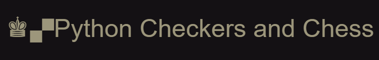

---------




-----------

💬 Welcome to my first game project
===

✅ 🙾Here you can try to play checkers with a bot 

❌ ♟ And also online chess (not ready yet!!)️

#

----

*__What should I do to run the game?__*
===========

----
```
🟢step1) git clone repository this repository
```

🔗[Here is the link for repository](https://github.com/Rudolf199/project1.git)

```
1. From the repository, select the Clone button.

2. Copy the clone command (either the SSH format or the HTTPS).
If you are using the SSH protocol, ensure your public key is in Bitbucket and loaded on the local system to which you are cloning.

3. From a terminal window, change to the local directory where you want to clone your repository.

4. Paste the command you copied from Bitbucket, for example:
```
###**Clone over HTTPS**
```
git clone https://github.com/Rudolf199/project1.git
then type following to open repository
    cd project1
    
```


###**~~Clone over SSH~~**

###⛔ unavailable(no public ssh key)*

#


-------

```
🟢step 2) you should install python3 and pip3 command

    sudo apt update
    sudo apt install python3-pip
```

-------
###
```
🟢step 3) now to build the project you need to insall pygame module
    python3 -m pip install -U pygame --user
```

--------
##
```
🟢step 4) run chess/ checkers game, to run this just run the GameMenu file
``` 
```
    python3 GameMenu.py
```
and choose which game you want


------


📱 Let me know if you are having problems

 [here](https://t.me/Roudolf)
